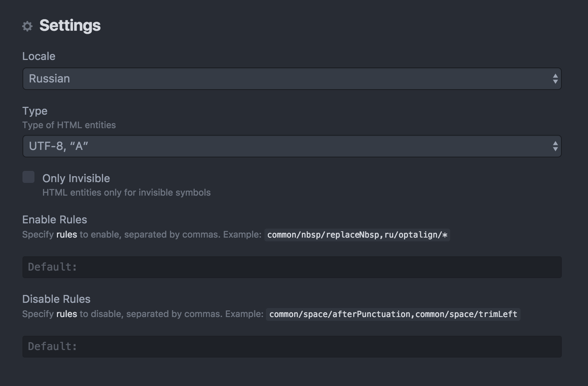

# Red Typography Package
Helps to automatically place the non-breaking spaces, correct small typos, replace the quotation marks to a correct format and much more.

## Usage
Select text and press the associated keybinding (<kbd>Ctrl</kbd>+<kbd>Option</kbd>+<kbd>T</kbd> on macOS or <kbd>Ctrl</kbd>+<kbd>Alt</kbd>+<kbd>T</kbd> on Lunix, Windows) for typographing text.

You can also use the Atom Command Palette and choose the `Red Typography: Process`, or use the `Typography` action in a context menu or use the application menu `Packages → Red Typography → Typography`.

## Settings
Choose the `Preferences → Packages → red-typography` or the `Packages → Red-Typography → Settings`.

## Dependencies
— [typograf](https://www.npmjs.com/package/typograf)
